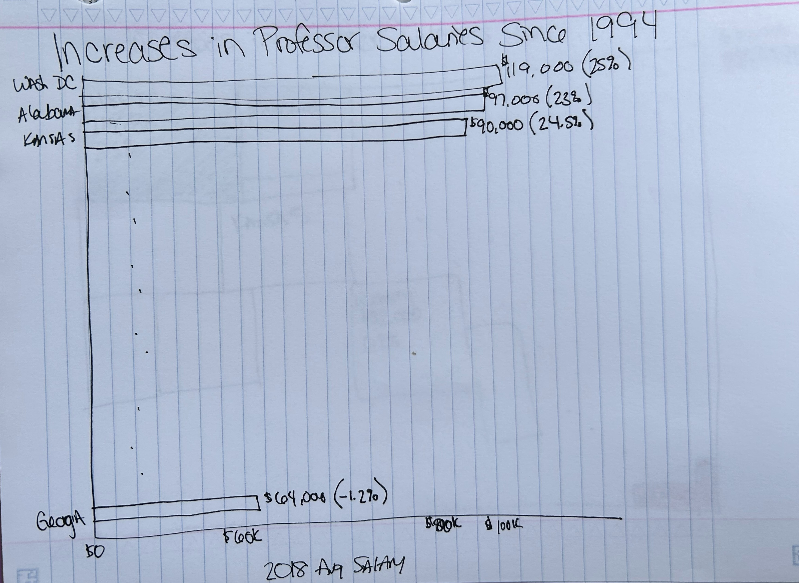
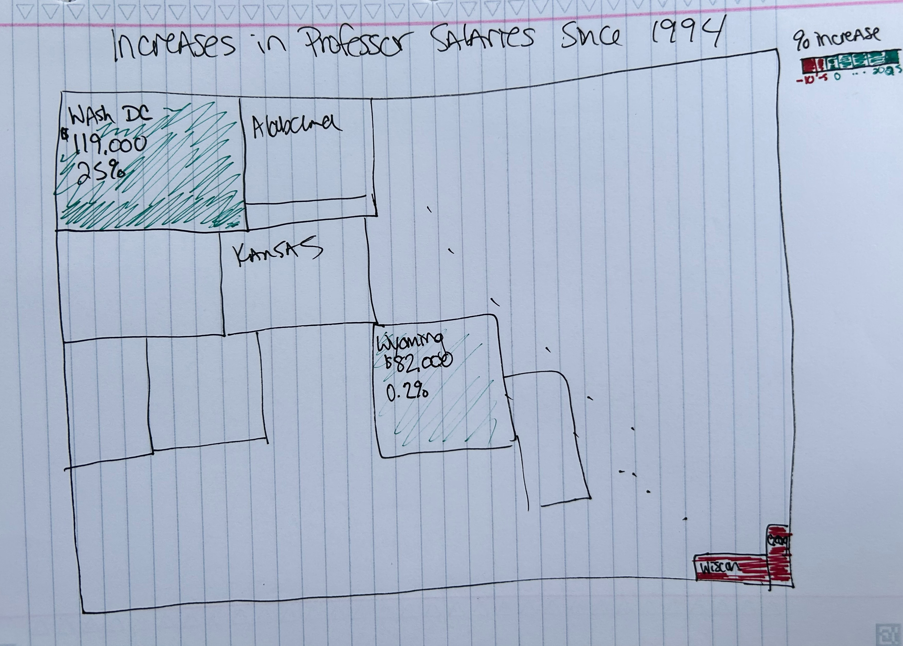

# Critique by Redesign

## Part I: Original Visualization
The original visualization can be found in the article *Study: For Full-Time College Faculty, Inflation-Adjusted Salaries Up Only 9.5% Since 1970* at
[Lending Tree](https://www.lendingtree.com/student/historical-faculty-pay-study/#:~:text=The%20average%20salary%20for%20full,had%20only%20risen%20to%20%2488%2C703.).
Approximately halfway down the page is a subsection titled *Faculty salary increases by state, from the District of Columbia to New Mexico*. Here you will find the visualization titled *State look: Where faculty pay has risen the most*, 
this is the original visualilzation I redesigned. 

This visualization is two parts, the first being an interactive map of the United States and the second being an accompanying table of data. I chose to redesign this visualization for a few reasons. 
The first being that have numerous family members involved in the education system and so the pay of professors and educators is a topic that I have a vested interest in. Second, I found this visualization to be good, but not great. 
There are numerous visualizations within the article and most of them are very well done. They are easy to read and require little additional thought by the reader to comprehend and digest. 
However, the particular graph of the United States with accompanying table fell short in comparison. 
I found that the map itself was almost unneccesary and the table could stand alone. But, I wanted to improve the two of these visualization by combining the map chart and table
into one visualiation that told the story of both ranking and the change in salary from 1994-2018. 

## Part II: Initial Critique
For this critique, I followed Stephen Few's [Data Visualization Effectiveness Profile](http://www.perceptualedge.com/articles/visual_business_intelligence/data_visualization_effectiveness_profile.pdf). I found the following:

**Usefulness: 3.** While there is information within the map visual, the details and important information is in the chart below it. The map itself could be deleted altogether and there would be no loss of information or usefulness. 
The map visual itself has little information, just rankings and percent change in pay. However, this information can only be gleaned via hovering over the state, which makes it impractical for print or static use. 
The visualization statically gives almost no information with the color schemed not defined at all. 

**Completeness: 6.** The map gives ranking and percent change when hovered over. However, it is missing the actual values of pay, what the color scheme means (it is rank but that took some time to figure out), and a time frame.

**Perceptibility: 3.** The color scheme is useful in seeing that there is a difference in something but there is no clear explanation as to what it is saying. 
It is not until you hover over a few states or reference that chart below that you start to see that the visualization color scheme refers to rankings, grouped into sets of 5, and that 1-5 is the best and 45-50 the worst. 
It also has a 51st rating due to inclusion of Washington D.C. but the scale indicated 50 as the highest rating.

**Truthfulness: 9.** There is no wrong or inaccurate data, each state has one color, one ranking and one percent change. 
It also makes the comparison in inflation adjusted values. However, one thing this chart does not necessarily account for is the cost of living in each of these states, and that specific inflation rate, 
and how that has affected the salary change. It accounts for some nuances like that by using percent change. 

**Intuitiveness: 9.** A map of the US is very familiar, and the color scheme fits into what would be naturally viewed as green being positive and red being more negative. 

**Aesthetics: 7.** The visual is not necessarily beautiful, but it is simple, not overly busy, familiar in shape and color and an adequate scale to see easily. 

**Engagement: 5.** I believe this visualization to be truly neutral. It does not distract from the data but also gives no reason to interact with or draw one to the data. 
It allows for simple clicks to interact and see certain groupings of states, but there is little engagement beyond that unless you look at the chart below. 

## Part III & IV: Initial Sketches and User Testing
Following the critique, I realized I wanted to combine the United States map chart of rankings with the table of data below. I wanted to try to show everything in one visualization that was relatively easy
to look at and comprehend. I also wanted it to be able to be printed, so limiting need for interaction such as hovering over states.
I initially started with two initial rough sketches, seen below. The first being a bar chart that would be ranked from highest 2018 salary to lowest. The second being a tree diagram where size of the rectangle would indicate relative
percent change in salary. The bar chart had no colors, but had labels to indicate current salary and percent change. The tree diagram had color to indicate degree of change, with red indicating a loss in salary. 

Before starting interviews and gathering user feedback, I had already formed some opinions on improvements that could be made and which visual was better. However, I wanted to see what other individuals gathered from the two visuals before making any decisions. For reference, the first visual is the bar graph and tree diagram the second. The feedback as as follows:

**female, 31, lab scientist** 
*What do you see in these visuals right away?* Change in professor salaries per state over time.

*Do you prefer one visual to the other, and why?* The second visual is harder to understand and comprehend. I cannot see the smallest states. 

*Which visual would you use and is there anything you would change or questions you have about it?* The bar chart. Is the graph purely the increase or total with
the increase? For example, is D.C. increased by $100k so they make $200k now or is it $100k now and was $80k? I would like to see the 1994 salary to better show the increase.

**male, 53, college professor**
*What do you see in these visuals right away?* Change in salary. Professors looking for work and where to go could use.

*Do you prefer one visual to the other, and why?* I do not know how to read the second graph (Tree diagram). The bar chart is simple and easy.

*Which visual would you use and is there anything you would change or questions you have about it?* The bar chart. Maybe show the top and bottom states for comparison.

**female, 65, retired teacher**
*What do you see in these visuals right away?* Change in salary. Big differences in the states. Some states loss overall salary.

*Do you prefer one visual to the other, and why?* I like the color in the second to show the differences in change, but the bar chart is easier to read. It took me less time to understand.

*Which visual would you use and is there anything you would change or questions you have about it?* The bar chart. I want to see the 1994 salary so I know what the increase actually means. Maybe add color like in the second visual to show differences in salaries.

From these, I discovered that most people do not know what a tree diagram is from a bare minimum sketch. If I was going to use that, I should have had a full example visual. However, I do not think it would have been useful as it seems like it is not well known and not easy to read. The bar chart was by far the favorite. But, most people wanted to see the 1994 salary or a reference to them. A majority of the feedback received can be implemented and was doable given the data. 

# Part V: Final Design
After conducting testing, I decided to stick with a bar chart. I organized the bar chart from highest 2018 salary to lowest. This still does not tell the whole story. For example, Alaska is around the middle in terms of 2018 salary, but it had a decrease in overall salary since 1994. So, to show this I added the color gradient to indicate the change in salary with a legend on the side. I also labeled each bar with the 2018 salary and percent change. Finally, I added a reference line for the 1994 salary. This allows readers to easily reference the original point without adding additional clutter to the labels or colors. 

